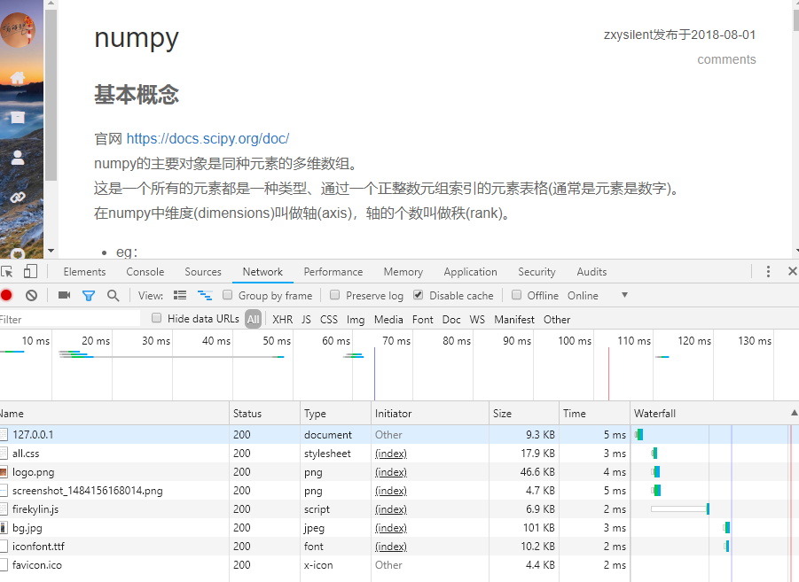
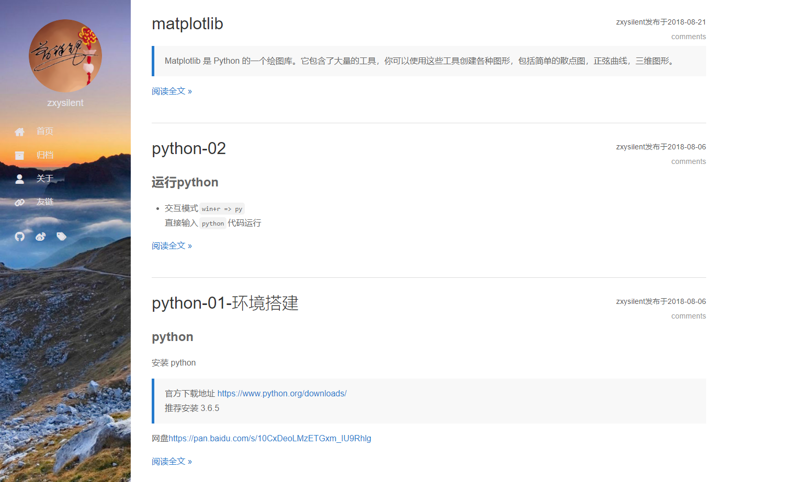
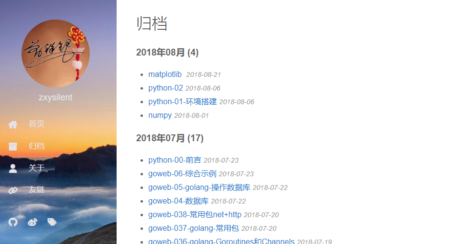
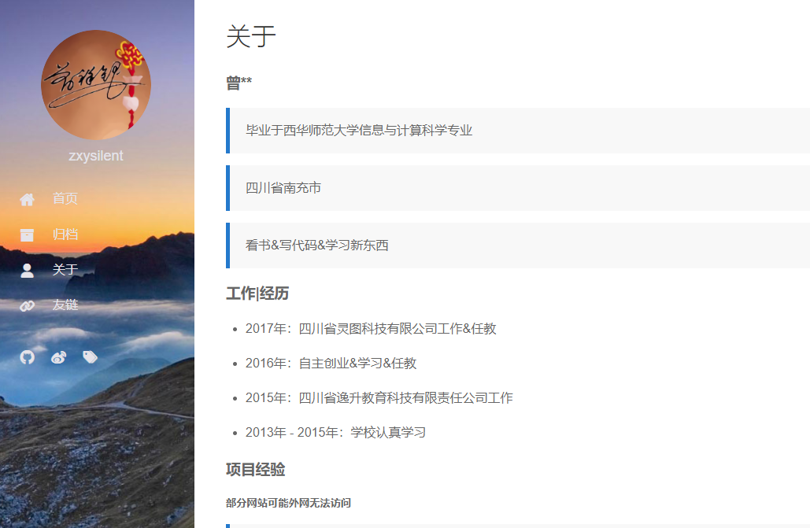
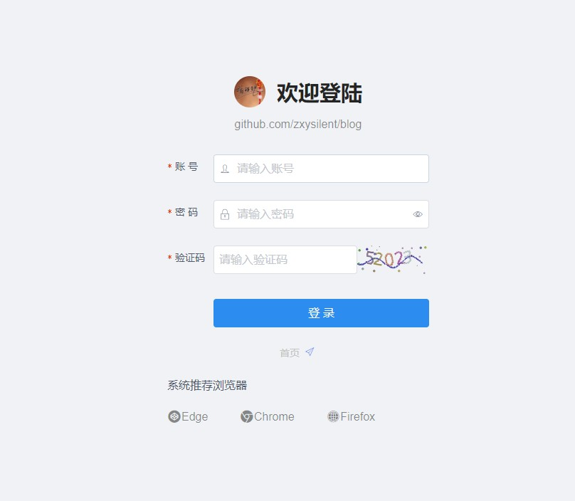
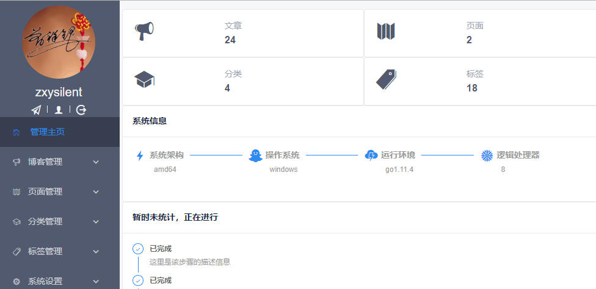
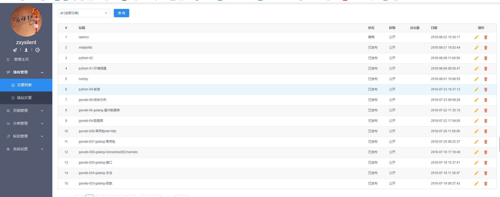
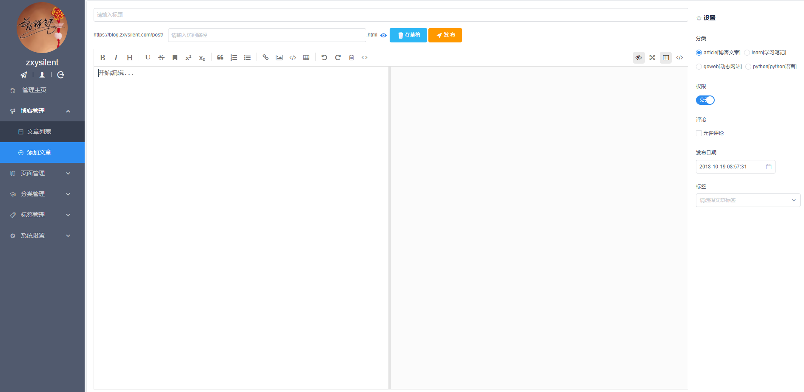
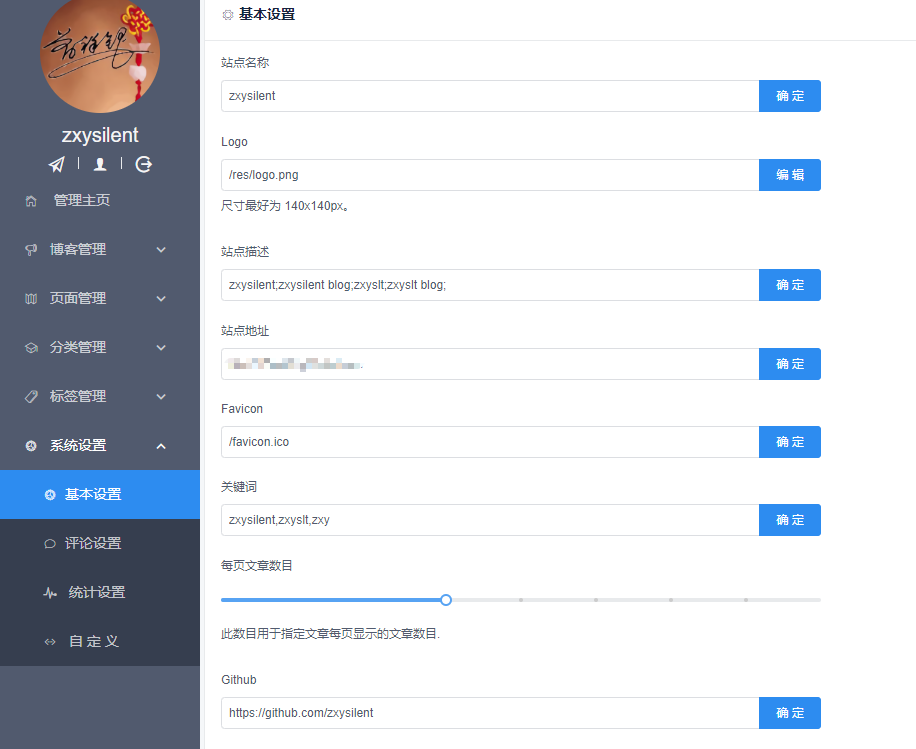

## 理念

- ### 作为 [obsidian](https://obsidian.md/) `Or` [Logseq](https://logseq.com/) 的前端展示层
  - 更多关于  或 logseq 信息 请自行搜索 如下是推荐的几个参考
    - [Obsidian是什么以及它能用来做什么](https://sspai.com/post/67399)
    - [Logseq小白系列教程入门篇](https://cn.logseq.com/t/topic/91)

- ### 驱动 没有比较自由定义的发布逻辑 目前可以知道的几种发布流程 都有自我认知的不方便的case
    - 基于`hugo`的 [quartz](https://quartz.jzhao.xyz/) (目前使用中)
      - 一个演示站 [🌿 oldwinterの数字花园](https://garden.oldwinter.top/)
      - 适合纯展示用 结合`github page` 较为方便
      - 基于静态页面 改动成本较大
      - 无法定义相关api 
    - 基于 `logseq` 自带发布功能
      - [logseq doc](https://docs.logseq.com/#/graph) 本身就是基于自动发布功能进行的展示
      - [中文社区说明](https://wsin.vercel.app/#/page/readme)
      - 效果和本地库完全一致 可以作为展示库使用
      - 发布为单个文件 `index.html` 完全无法扩展功能

- ### 思路

  - 本地启动解析脚本 监控文件变动 在文件有打上对应标签之后 开始进行发布流程
  - 解析相关内容 推到到指定服务器
  - 在服务器进行内容更新和发布

## Next

- ### 改造为 gin+gorm+sqlite

## Roadmap
- ### TODO
- [x] 使用sqlite可以干净运行 无需其他配置
  - [ ] 但是引入几个其他问题 sqlite数据库 无法支持自动过滤`\n` 等符号 需要后续解决
  - [ ] 导入现有数据会有报错 需要手动考虑进行转换后进行导入
- [ ] 引入关系链 可以显示无限制的页面和标签层级
- [ ] blog admin api化 可以使用在外部推送数据到显示层

--- 

### 引用自: [一个 go语言实现的博客](https://github.com/zxysilent/blog)
<details>
<summary>展开查看</summary>

#### 技术栈
- golang
  - vue
  - echo 框架
  - 前台界面目前修改于 https://firekylin.org/

### 预览地址

[https://blog.zxysilent.com/](https://blog.zxysilent.com/)

### 开发原因 
- 现在自己使用博客系统不方便管理、部署和二次开发
  - 渲染速度到不到想要的效果

### 计划功能
实现```blog```功能和基本```cms```功能,提取快速开发框架和通用后台管理界面
- [x] 文章管理
  - [x] 页面管理
  - [x] 分类管理
  - [x] 标签管理
  - [x] 系统设置
  - [x] 管理主页

### tips

- 替换markdown 编辑器为富文本编辑器即可作为`CMS`  
[https://github.com/zxysilent/view-design-admin](https://github.com/zxysilent/view-design-admin)

  - 富文本预览地址  
  [http://76.zxysilent.com/demos/view-design-admin/index.html#/pages/editor](http://76.zxysilent.com/demos/view-design-admin/index.html#/pages/editor)

### 讨论群
🐧🐧 1059282178

### 使用方式
```
git clone https://github.com/zxysilent/blog.git
```
若要部署，请修改关键信息[jwt、用户名、密码等]
数据库自带文章内容请在部署前删除

####  运行服务
- 配置```conf.toml```数据库信息
  - 还原 ```data```目录下 ```db.sql``` 数据库
  数据库自带文章内容请在部署前删除
  - 安装依赖
  - 安装 swag   
      ```go get -u github.com/swaggo/swag/cmd/swag```
  - 运行```swag init ```生成api文档
  - 运行后台 ```go run```  

####  运行后台
- 安装依赖 ``` npm install ```
  - 开发运行 ``` npm run serve ```
  - 浏览器打开 [http://127.0.0.1:8080/](http://127.0.0.1:8080/)
  - 发布 ```npm run build ``` 会自动发布到 ```dist```目录下面
  - 友链里面第一个为后台登陆地址默认用户名```zxysilent```,密码```zxyslt```，可自行数据库修改
### 评论配置
  - 配置项目 opts(表).comment(值) 
    - 配置说明 [https://github.com/gitalk/gitalk](https://github.com/gitalk/gitalk)
## 渲染性能


## 效果展示

### 前台




### 后台






## Donation
If this project help you a lot, you can support us by:

AliPay


Wechat Pay


</details>